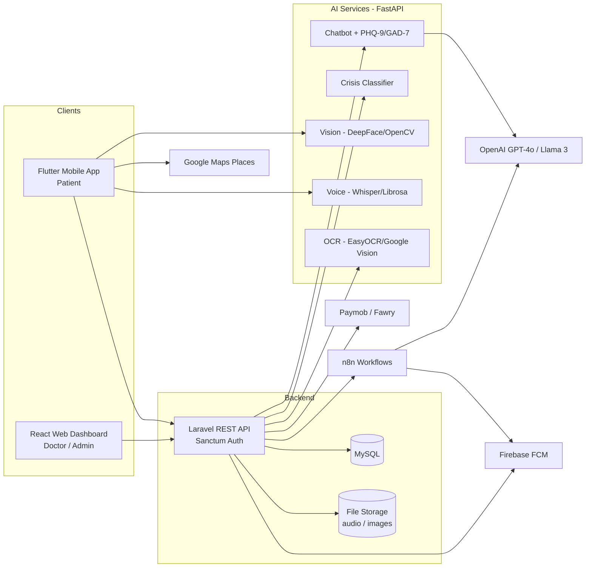

# MindCare – System Architecture

## 1. Overview

MindCare is made of four main parts that talk to each other over HTTPS:

| Component | Tech | Users |
|---|---|---|
| Mobile App | Flutter | Patients |
| Web Dashboard | React + TailwindCSS | Doctors, Admins |
| Backend API | PHP / Laravel + MySQL | Both clients |
| AI Services | Python (FastAPI) | Called by the Backend / Mobile App |

Supporting services: **n8n** (scheduled workflows), **Firebase Cloud Messaging** (push notifications),
**Paymob / Fawry** (payments), **Google Maps Places API** (pharmacies), **OpenAI / Llama 3** (LLM).

## 2. High-Level Diagram

## 3. Roles & Access Control

- One `users` table with a `role` column: `patient | doctor | admin`.
- Authentication with **Laravel Sanctum** (or JWT); every API request carries a bearer token.
- Role middleware on routes:
  - `patient` → own data only (chat, moods, appointments, prescriptions).
  - `doctor` → only patients who booked or were assigned to them.
  - `admin` → user management, doctor approval, system reports.
- After login: Flutter routes to patient screens, React routes to the doctor/admin dashboard.

## 4. Main Data Flows

### 4.1 AI Chat → Report → Prescription
1. Patient sends a message from the app → `POST /chat/messages`.
2. Backend runs the **crisis check** first (see 4.2), then forwards to the Chatbot service.
3. Chatbot (LLM + system prompt with PHQ-9 / GAD-7 guidance) replies in Arabic and records symptoms.
4. When the session ends, the AI produces a **JSON summary** → saved in `medical_reports`.
5. The report appears on the doctor's dashboard; the doctor writes an e-prescription (`prescriptions`),
   prints it or sends it to the patient's app.

### 4.2 Crisis Safety Net
1. Every message passes a **fast keyword filter**, then a **semantic text classifier**.
2. If high risk is detected: chat stops immediately, the app shows an emergency window with hotline numbers,
   and an **urgent notification** is sent to the doctor (FCM + dashboard alert).
3. This check also runs in Private Venting mode, without storing the message (see 4.3).

### 4.3 Private Venting (zero persistence)
- Messages are processed **statelessly / in memory** only.
- No `INSERT` into MySQL, no logging of message content, and nothing sent to the doctor.
- Only the crisis check result (risk / no risk) may trigger the emergency window; the text itself is never stored.

### 4.4 Multimodal Mood Index
1. Text score from chat analysis, Vision score from the facial emotion API, Voice score from tone analysis.
2. Backend computes: `Final Score = 0.5 × Text + 0.3 × Vision + 0.2 × Voice`.
3. Stored with a timestamp and shown as a **timeline chart** on the doctor's dashboard.
4. If one modality is missing, re-normalize the weights over the available ones.

### 4.5 Prescription OCR & Pill Reminders
1. Patient uploads a prescription image → OCR service extracts medicine names and schedule.
2. Patient confirms/edits the extracted result (handwriting OCR is not perfectly reliable).
3. App schedules reminders with `flutter_local_notifications` + FCM.
4. **Pharmacy Finder** uses GPS + Google Maps Places API to list nearby pharmacies.

### 4.6 Booking & Payment
1. Doctor defines available slots (`appointments`); a slot-booking check prevents double booking
   (DB transaction + unique constraint on doctor + time).
2. Patient selects slot and type (online / in-person) → payment via Paymob/Fawry.
3. Payment webhook confirms → booking status becomes `confirmed`.
4. n8n sends reminders: **1 day before**, **1 hour before**, and **at session time**.

### 4.7 Weekly Status Summary
- n8n cron job (end of each week) collects mood and session data → LLM generates a statistical summary →
  saved and shown on both patient and doctor screens.

## 5. Suggested Database Tables

`users`, `doctor_profiles`, `patient_profiles`, `chat_sessions`, `chat_messages`, `medical_reports`,
`prescriptions`, `prescription_items`, `appointments`, `payments`, `mood_logs`, `multimodal_scores`,
`daily_tasks`, `user_progress`, `articles`, `article_tags`, `audio_tracks`, `weekly_summaries`,
`notifications`, `crisis_alerts`.

> Note: Private Venting has **no** table by design.

## 6. Security & Privacy

- HTTPS everywhere; passwords hashed (bcrypt/argon2); tokens with expiry.
- Sensitive fields (reports, chat content) encrypted at rest where possible.
- Doctors can only read data of their own patients; log every doctor access to patient data.
- Camera and microphone used only with explicit consent, and raw images/audio are deleted after analysis.
- API keys only in `.env` – never committed.
- Rate limiting on auth and AI endpoints.
- The app is a support tool, not a diagnosis: show a disclaimer and keep human doctors in the loop.

## 7. Deployment (suggested)

- Backend + MySQL: VPS or cloud (Nginx + PHP-FPM), or Docker Compose.
- AI services: separate container (needs more RAM; GPU optional).
- Web dashboard: static build on Netlify/Vercel/Nginx.
- n8n: self-hosted container.
- Mobile: APK for the demo, Play Store optional.
